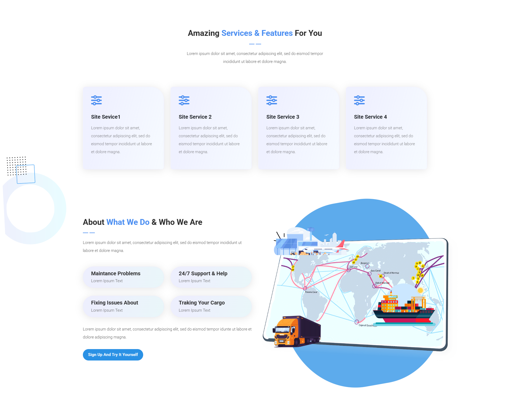

# 🛳 Arab Cargo

 Arab Cargo Platform - Bridging International Shipping with Local Needs

---

## 🌟 **Features**
- ✅ Feature 1: Clean & Intuitive Interface: Easy navigation and quick access to essential information.
- ✅ Feature 2: Responsive Design: Seamlessly adapts to mobile, tablet, and desktop devices for a smooth experience.
- ✅ Feature 3: Animations: Integrated animations created with CSS and JavaScript to provide a dynamic and engaging user experience.

---

## 📸 **Screenshots**
Screenshots showcasing the website interface or key features:

- **Homepage:**
  
  
  

- **User Authentication:**
  

---

## 🛠️ **Technologies Used**
- HTML
- CSS
- Bootstrap
- JavaScript

